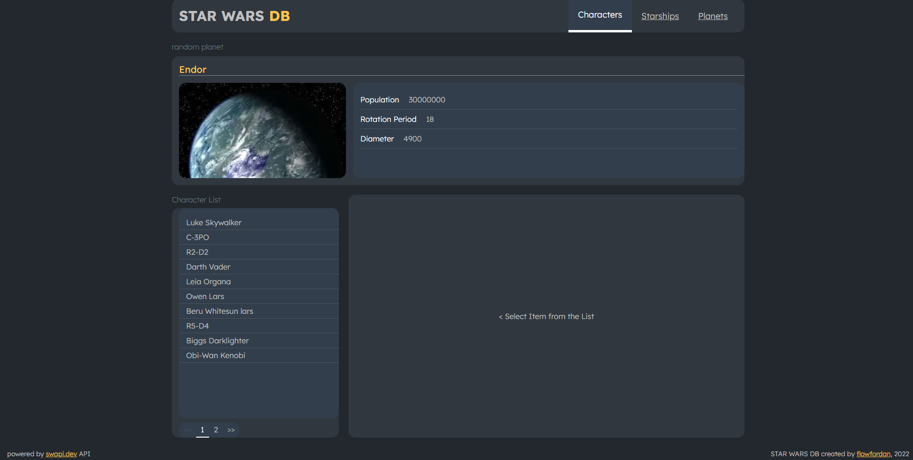
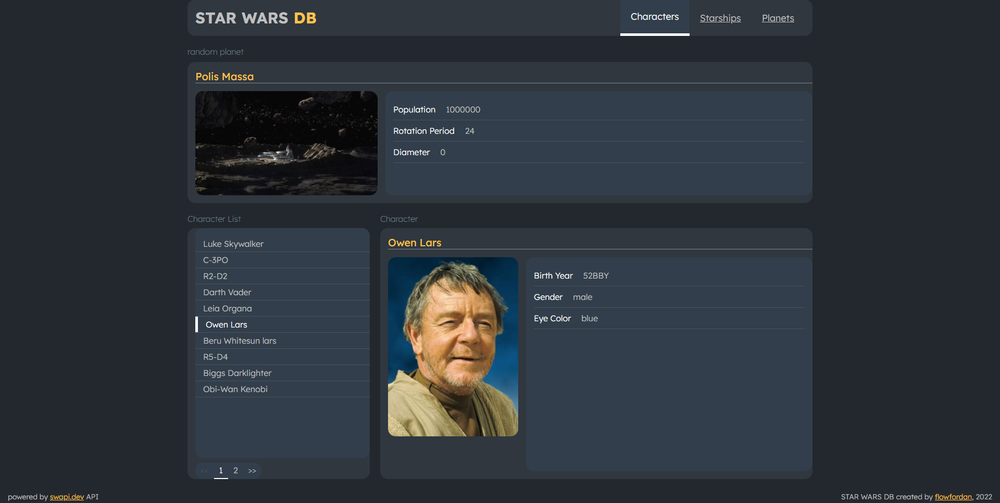

# Star Wars DB

## What is it?
 

 
 

### General information
This is small web-based app that takes data from open SW APIs and visualises it in a way you can enjoy.

Most of the data is taken from https://swapi.dev/api, images are from https://starwars-visualguide.com 
 
 

### How to use it
 
You can try STAR WARS DB on https://flowfordan.github.io/star-db/.
 
 
There are 3 categories available: characters, planets and starhips, at least for now. In each category you'll find a list of items with some information about it.
 
 

 
 

## Stack
Project uses React, React Router. 
Material UI was used some time ago, now it's being cleaned out.